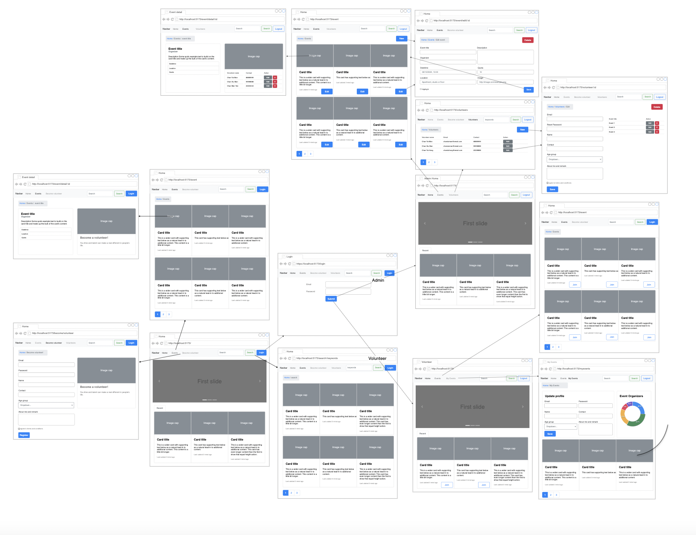
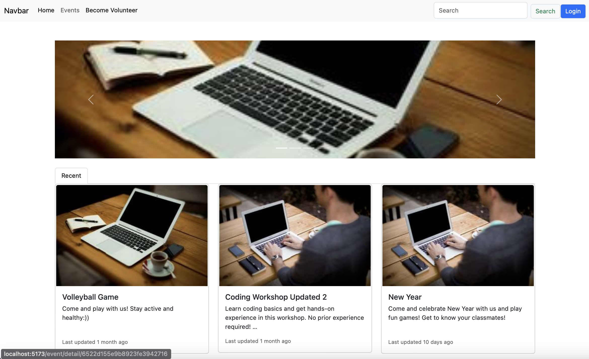

## <a id="about"></a>📖 About

### Live Demo: https://volunteer-manager.netlify.app (some APIs no longer work as they were hosted as part of the course)

Event and Volunteer Management system is a robust web application that simplifies event and volunteer management. It allows administrators to create, edit, and delete events, and manage volunteer registrations. Volunteers can register themselves, and admins can manually add and edit volunteer information. The system provides detailed views of events and volunteer profiles, ensuring effective event planning and execution.




## Table of Contents

- [About](#about)
- [Role Based Logins](#Role-Based)
- [Project Setup](#Project-setup)
- [Views](#Sap-view)
- [Assignment2-Notes](#Assignment2-Notes)
- [Assignment3-Notes](#Assignment3-Notes)

## <a id="Role-Based"></a>📖 Role-Based Logins

### 1. Admin Login:

```
Email: admin@gmail.com
Password: 1234
```

### 2. Volunteer Login:

```
Email: john.newman@example.com
Password: 1234
```

### 3. Visitor Login:

```
Just browse the website
```

## <a id="Project-setup1"></a>🚀 Project Setup Frontend

_run backend & frontend_
_ad your MongoDB URL_

1. Go to backend folder

> cd backend

2. Install needed packages

> npm install

3. Run using nodemon

> npm run dev

or

> npm start

4. Go to `localhost:3000`

## <a id="Project-setup"></a>🚀 Project Setup Frontend

1. Go to Frontend folder

```sh
cd frontend
```

```sh
npm install
```

### 🔥 Compile and Hot-Reload for Development

```sh
npm run dev
```

### 🏗️ Compile and Minify for Production

```sh
npm run build
```

## <a id="Sap-view"></a> 📖 Views

### 1. `CreateEvent.vue`

- used for Creating Event (create-event view), Editing Event (update-event view), Deleting Event (update-event view).

### 2. `Events.vue`

- used for Showing all Events (events view) and Searching Events that match keywords (event-serch view).

### 3. `HomeView.vue`

- shows three recent highlighted events and three recent events.

### 4. `Volunteer.vue`

- used for volunteer registration (become-volunteer view), editing & deleting (update-volunteer view).

### 5. `VolunteersView.vue`

- Shows a table of volunteers (view-volunteers view).

## Used frameworks/libraries

- Vue.js
- Vue Router
- Oruga (Tables)
- Bootstrap
- Material Design Icons

---

## 📝 Steps Taken

[x] Add volunteer Edit

### Components

[x] Breadcrumb

### Event (SAP)

[x] Event detail
[x] Event detail: Edit frontend
[x] Event Edit
[x] Event edit: check editing
[x] Event edit: check deleting
[x] Event new
[x] Event new Check Database Addition
[x] different navbar-s for every event

### Volunteer (SAP)

[x] Become Volunteer
[x] Volunteer Table
[x] new button -> go to become/vol Volunteer ????
[x] Volunteer Edit
[x] Volunteer Delete

### Main pages

[x] Home page Draft
[x] Home page Final -> Carousel responsiveness
[x] Event page Draft
[x] Event page Final
[x] Pagination

### Functionalities

[x] bootstrap js
[x] fix events pagination (1,2,3) not showing
[x] Search
[x] Add new Event button in `event`
[x] Add edit Volunteer
[x] fix padding for every page

## <a id="Assignment2-Notes"></a>Assignment 2 Notes

### views

- Add Navbar:

1. Event-detail ✅
2. Event - edit ✅
3. become-volunteer ✅
4. event ✅
5. home ✅
6. volunteers ✅
7. new event ✅
8. keywords ✅
9. volunteer-info

- Add Breadcrumb:

1. view-event ✅
   > `Home/Events/Event Title`
2. update-event ✅
   > `Home/Events/Edit Event`
3. become-volunteer
   > `Home/Become Volunteer`
4. events ✅
   > `Home/Events`
5. home ✅
   > none
6. view-volunteers ✅
   > `Home/Volunteers`
7. create-event ✅
   > `Home/Events/New Event`
8. event-search ✅
   > `Home/Search`
9. volunteer-info
   > `Home/Volunteers/Edit`

## Recommended IDE Setup

[VSCode](https://code.visualstudio.com/) + [Volar](https://marketplace.visualstudio.com/items?itemName=Vue.volar) (and disable Vetur) + [TypeScript Vue Plugin (Volar)](https://marketplace.visualstudio.com/items?itemName=Vue.vscode-typescript-vue-plugin).

## <a id="Assignment3-Notes"></a>Assignment 3 Notes

## Visitor:

1. - [x] Home page
2. - [x] Event page
3. - [x] See Event
4. - [x] Become Volunteer :
   - [x] Become w/o token

## Volunteer

1. - [x] Home page

- [x]has join
- [x]my events in navbar

2. - [x] Event page

- [x] has join
- [x] Join event adds to user and to event
- [x] my events in navbar

3. - My events

- [x] Change my information
- [x] Events

## Admin

1. Home

- [x] navbar has volunteers
- [x] no edit button here

2. Events

- [x] has edit button
- [x] new

3. Edit Event

- [x] Delete
- [x] Edit event

4. Volunteers

- [x] table
- [x] Edit button
- [x] new button

5. Edit volunteer

- [x] Delete
- [x] table
- [x] withdraw
- [x] edit event
- [x] Edit Volunteer

6. Event details

- [x] all volunteers
- [x] remove volunteer

## Change:

- [x] Admin: Volunteers -> new goes to creating new volunteer page
- [x] can admin create new volunteer?
- [x] Check backend settings
- [ ] !My Events UI
- [x] !add middleware for isAdmin / isVolunteer

## Easy Fixes:

- [x] Color of Login Button

## Volunteer:

- My Events page:
  diagram
- [x] Be able to edit herself
- [x] Join Event
- [x] get event organizers

## Admin panels

- home page has volunteers (change navbar and more if like if admin)
- Protect Event edit/delete/new in `index.js`

1. Home Page
2. Event Page

- Have edit button

3. Volunteers
4. See one volunteer

- [x] Show registered events
- [x] Withdraw from event

5. Edit event

6. event detail page
   NEXT

## Overall:

- [x] add ifAdmin as middleware
- [x] after logout go to login
- [x] Navbar messing up login/logout
